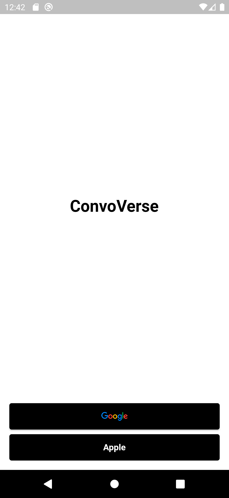
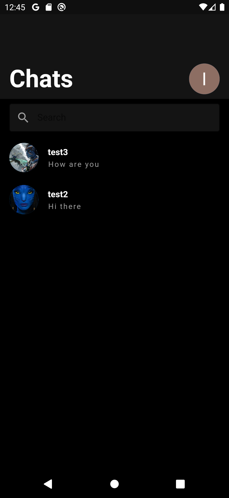
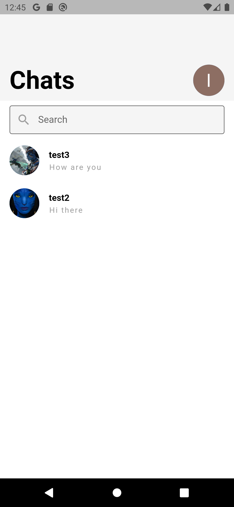

# firebase

ConvoVerse - мессенджер с адаптивной темой

ConvoVerse - это мобильное приложение-мессенджер, разработанное с использованием современной архитектуры Clean Architecture. В рамках этой архитектуры, проект ConvoVerse организован по принципу разделения на фичи (features).

Каждая функциональная возможность приложения, такая как отправка сообщений, управление контактами или уведомления, выделена в отдельный модуль, известный как feature. Каждый feature содержит свой собственный набор представлений (UI), презентеров (Presenter) и репозиториев (Repository), что обеспечивает логическую разделенность и упрощает разработку, тестирование и поддержку приложения.

Такой подход позволяет команде разработчиков работать параллельно над различными фичами приложения, не затрагивая другие части кодовой базы. Это ускоряет процесс разработки и обеспечивает высокую гибкость и масштабируемость приложения.

В проекте ConvoVerse используются следующие технологии и инструменты:

Flutter: Кросс-платформенный фреймворк для разработки мобильных приложений.
Firebase: Платформа разработки приложений, предоставляющая различные сервисы, включая аутентификацию, базу данных в реальном времени и облачное хранилище.
WebRTC: Технология для передачи аудио и видео в режиме реального времени через сеть Интернет.

--------------------------------------------------------------------------------------------------------------------------------------------------

ConvoVerse - messenger with an adaptive theme

ConvoVerse is a mobile messenger application developed using the modern Clean Architecture architecture. Within this architecture, the ConvoVerse project is organized according to the principle of separation into features.

Each functionality of the application, such as sending messages, managing contacts or notifications, is allocated in a separate module known as feature. Each feature contains its own set of views (UI), presenters (Presenter) and repositories (Repository), which ensures logical separation and simplifies the development, testing and support of the application.

This approach allows the development team to work in parallel on various application features without affecting other parts of the code base. This speeds up the development process and provides high flexibility and scalability of the application.

The ConvoVerse project uses the following technologies and tools:

Flutter: A cross-platform framework for mobile app development. Firebase: An application development platform that provides various services, including authentication, a real-time database and cloud storage. WebRTC: Technology for real-time audio and video transmission over the Internet.

## Getting Started

This project is a starting point for a Flutter application.

A few resources to get you started if this is your first Flutter project:

- [Lab: Write your first Flutter app](https://docs.flutter.dev/get-started/codelab)
- [Cookbook: Useful Flutter samples](https://docs.flutter.dev/cookbook)

For help getting started with Flutter development, view the
[online documentation](https://docs.flutter.dev/), which offers tutorials,
samples, guidance on mobile development, and a full API reference.
