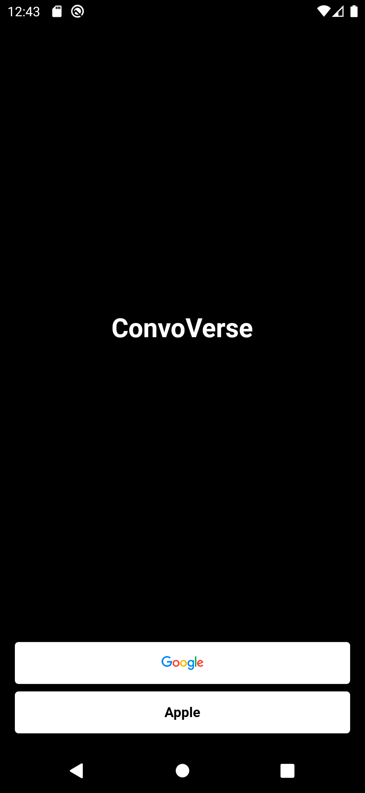

# firebase

ConvoVerse - мессенджер с адаптивной темой

ConvoVerse - это мобильное приложение-мессенджер, разработанное с использованием современной архитектуры Clean Architecture. В рамках этой архитектуры, проект ConvoVerse организован по принципу разделения на фичи (features).

Каждая функциональная возможность приложения, такая как отправка сообщений, управление контактами или уведомления, выделена в отдельный модуль, известный как feature. Каждый feature содержит свой собственный набор представлений (UI), презентеров (Presenter) и репозиториев (Repository), что обеспечивает логическую разделенность и упрощает разработку, тестирование и поддержку приложения.

Такой подход позволяет команде разработчиков работать параллельно над различными фичами приложения, не затрагивая другие части кодовой базы. Это ускоряет процесс разработки и обеспечивает высокую гибкость и масштабируемость приложения.

В проекте ConvoVerse используются следующие технологии и инструменты:

Flutter: Кросс-платформенный фреймворк для разработки мобильных приложений.
Firebase: Платформа разработки приложений, предоставляющая различные сервисы, включая аутентификацию, базу данных в реальном времени и облачное хранилище.
WebRTC: Технология для передачи аудио и видео в режиме реального времени через сеть Интернет.

## Getting Started

This project is a starting point for a Flutter application.

A few resources to get you started if this is your first Flutter project:

- [Lab: Write your first Flutter app](https://docs.flutter.dev/get-started/codelab)
- [Cookbook: Useful Flutter samples](https://docs.flutter.dev/cookbook)

For help getting started with Flutter development, view the
[online documentation](https://docs.flutter.dev/), which offers tutorials,
samples, guidance on mobile development, and a full API reference.
